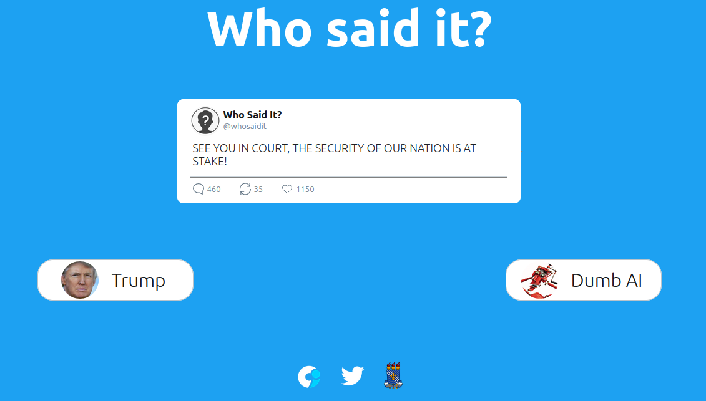

<h1 align="center" width="220px">
    Who said it?
</h1>

  <a href="#rocket-tecnologias">Tecnologias</a>&nbsp;&nbsp;&nbsp;|&nbsp;&nbsp;&nbsp;
  <a href="#-projeto">Projeto</a>&nbsp;&nbsp;&nbsp;|&nbsp;&nbsp;&nbsp;
  <a href="#-como-contribuir">Como contribuir</a>&nbsp;&nbsp;&nbsp;|&nbsp;&nbsp;&nbsp;
  <a href="#memo-licença">Licença</a>

 

  

 

  

## 🚀 Tecnologias

Esse projeto foi desenvolvido com as seguintes tecnologias:

- [React](https://reactjs.org)
- [TypeScript](https://www.typescriptlang.org/)

## 💻 Projeto

O Who said it? é um projeto desenvolvido para a disciplina de Inteligência Artifical, com o objetivo de postar os principais resultados obtidos pela nossa IA, a partir de tweets do Donald Trump.

## 🤔 Como contribuir

- Faça um fork desse repositório;
- Cria uma branch com a sua feature: `git checkout -b minha-feature`;
- Faça commit das suas alterações: `git commit -m 'feat: Minha nova feature'`;
- Faça push para a sua branch: `git push origin minha-feature`.

Depois que o merge da sua pull request for feito, você pode deletar a sua branch.

## :memo: Licença

Esse projeto está sob a licença MIT. Veja o arquivo [LICENSE](LICENSE) para mais detalhes.

---
